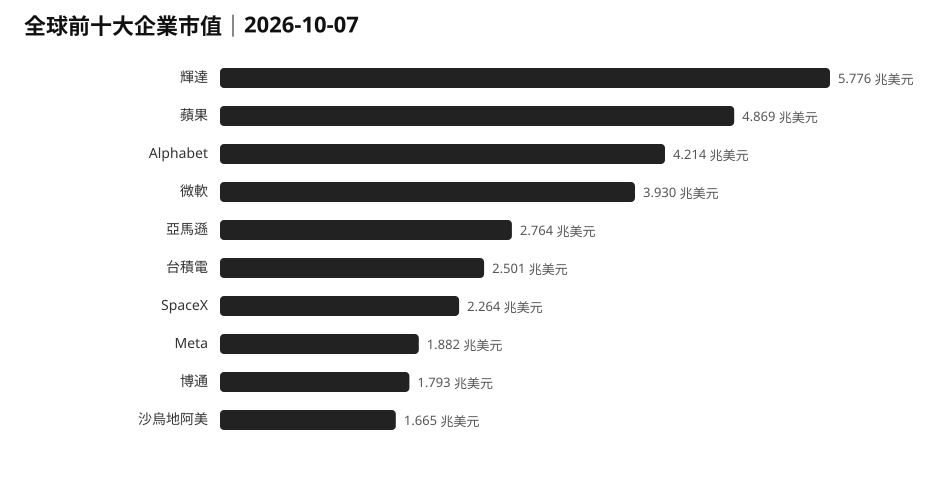
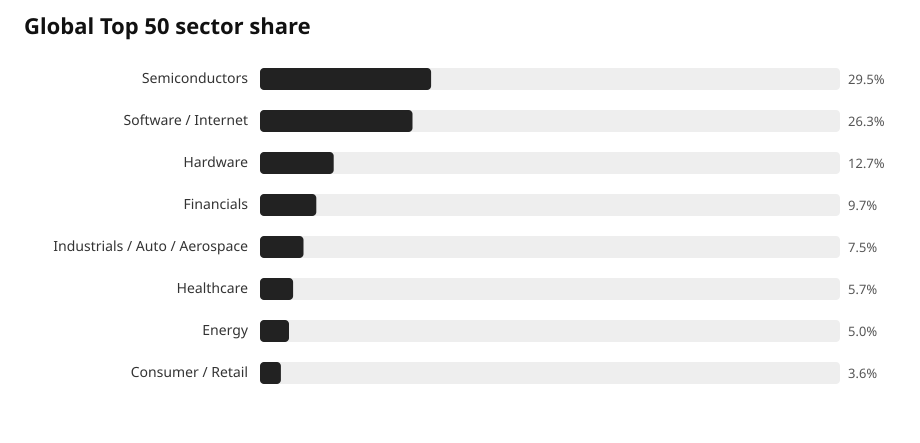
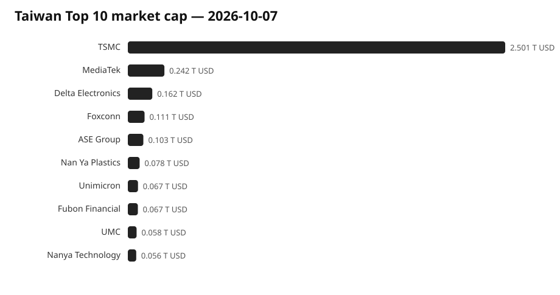
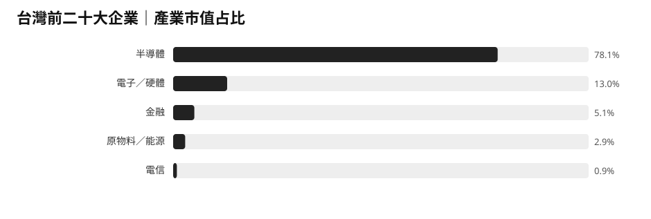

> 這是第一份完整估值基準。從明天起，會用每天保存的同一套資料直接計算 1 天、3 天、7 天變化。  
> 「成交金額」只代表交易熱度，不等於淨流入；沒有直接淨流量資料的區域，會明確標示使用的是代理指標。

## 今天先看結論

**錢還在追 AI 與科技，但已經不是所有市場一起漲。**

目前可以看到：

- **美國：** 大型科技仍吸引資金，但高殖利率開始和股票搶錢。
- **中國大陸：** 境內市場休市，香港科技股偏弱；10 月 8 日重新開市後才有新的確認。
- **台灣：** 指數高檔，但外資轉為賣超，資金部分轉向金融與傳產。
- **日本：** 科技與大型股仍強，市場制度改革可能讓資金更集中到大型高流動性公司。
- **韓國：** 外資明顯賣出，晶片股短線承壓。
- **歐洲：** 資金開始從財政風險較高的政府債撤出，轉向德國等相對安全市場。

所以今天真正的訊號不是「全球風險偏好上升」，而是：**資金正在更挑市場，也更挑公司。**

## 全球｜估值仍高度集中在科技

全球前 50 大企業本次合計市值約 **55.19 兆美元**。

| 產業 | 前 50 大企業市值占比 |
| --- | ---: |
| 半導體與設備 | 29.5% |
| 軟體與網路平台 | 26.3% |
| 硬體 | 12.7% |
| 金融 | 9.7% |
| 工業 / 汽車 / 航太 | 7.5% |
| 醫療 | 5.7% |
| 能源 | 5.0% |
| 消費 / 零售 | 3.6% |

半導體、軟體平台與硬體合計約占 **68.5%**。

截至 9 月 30 日的一週，全球股票基金淨流入約 **347.6 億美元**，前一週約 **443.1 億美元**，流入速度下降約 **21.6%**。

**觀察：** 科技公司的市值上升速度，已經比新增基金資金流入速度更快。這代表漲勢越來越依賴「既有資金願意支付更高價格」。

完整基準資料：[全球前 50 大企業 CSV](./global-top50-2026-10-07.csv)

## 美國｜錢仍進大型科技，但債券開始有吸引力

美股大型指數持續接近或刷新高點，AI 相關企業仍是主要推動力。

但長期美國公債殖利率已來到二十多年高位。

**推論：** 當安全性較高的長期債券也能提供很高利息時，股票必須交出更高獲利成長才能維持現在估值。這會讓資金更集中在少數真正能兌現 AI 收益的大型公司。

## 中國大陸｜本期缺少境內價格訊號，香港暫時偏弱

中國大陸股市因國慶假期休市到 10 月 7 日。

香港 10 月 7 日則偏弱，科技股跌幅大於大盤，市場仍擔心消費需求不足。

**觀察：** 目前看不出資金大幅重新回到中國風險資產。10 月 8 日開市後，要看境內科技與消費股是否有補漲，才能判斷假期後真正方向。

## 台灣｜市場很熱，但邊際資金開始換方向

台股 10 月 7 日收在約 **49,806 點**，成交約 **9,260 億元**。

外資單日淨賣超約 **130 億元**；大型科技股轉弱，但金融與部分傳產上漲。

台灣前 20 大企業合計市值約 **3.836 兆美元**，其中台積電單一公司約占 **65.2%**。

| 產業 | 前 20 大企業市值占比 |
| --- | ---: |
| 半導體 | 78.1% |
| 電子 / 硬體 | 13.0% |
| 金融 | 5.1% |
| 原物料 / 能源 | 2.9% |
| 電信 | 0.9% |

**觀察：** 台灣仍然極度集中在半導體，但 10 月 7 日已看到部分資金從大型科技轉向金融、塑化等其他族群。

這不等於半導體行情結束，但如果這種輪動持續數天，就表示資金開始降低單一產業集中。

完整基準資料：[台灣前 20 大企業 CSV](./taiwan-top20-2026-10-07.csv)

## 日本｜資金偏向大型、流動性高的公司

日經指數近期仍強，10 月 5 日單日曾上漲約 **2.4%**。

東京證券交易所也正進一步調整 TOPIX 成分規則，未來會淘汰大量小型、低流動性公司。

**推論：** 這種制度改革本身會讓追蹤指數的被動資金更集中到大型公司；若 AI、機械與電子股同時維持獲利，日本市場的集中度可能進一步提高。

## 韓國｜外資短線明顯撤出

韓國綜合股價指數 10 月 7 日下跌約 **1.98%**，外資單日淨賣出約 **2.6 兆韓元**。

Samsung 與 SK 海力士同步下跌。

**觀察：** 這是目前幾個主要科技市場中，最明顯的短期資金流出訊號之一。它不代表 AI 記憶體需求反轉，但表示投資人開始在高估值與財報前先降低部位。

## 歐洲｜錢正在重新選擇「哪個政府比較安全」

歐洲股市 10 月 7 日小幅下跌，但更大的訊號來自債券。

法國政府債券因財政赤字與政治不確定性遭到拋售，德國、荷蘭、瑞士等相對穩健市場則更受青睞。

**觀察：** 歐洲現在不只是股票產業輪動，而是國家信用本身正在被重新定價。

## 我現在怎麼判斷

### 錢往哪裡走？

仍偏向能直接受惠 AI 的大型企業，但開始更集中。

### 哪些地方變貴？

全球大型科技、台灣半導體仍是最明顯的高估值集中區。

### 哪些地方開始鬆動？

韓國已出現外資明顯賣出；台灣開始看到科技以外的輪動；歐洲則是政府債市場先出現分化。

### 最大風險在哪裡？

不是「AI 突然沒需求」，而是：**高利率維持太久，讓市場不再願意為同樣的成長支付現在這麼高的價格。**

接下來幾天，我會特別追蹤三個背離：

1. 股價續漲，但基金淨流入是否繼續下降。
2. 台灣指數維持高檔，但外資是否連續賣超。
3. 韓國外資賣出是否只是財報前短線調節，還是擴大成區域科技股降溫。

## 資料來源

- [全球企業市值排名](https://companiesmarketcap.com/)
- [台灣企業市值排名](https://companiesmarketcap.com/taiwan/largest-companies-in-taiwan-by-market-cap/)
- [TWSE｜台股指數與成交資料](https://wwwc.twse.com.tw/en/indices/taiex/mi-5min-hist.html)
- [中央社｜10 月 7 日台股與外資](https://focustaiwan.tw/business/202610070018)
- [Reuters｜全球股票基金資金流](https://www.reuters.com/world/china/global-markets-flows-graphic-2026-10-02/)
- [Reuters｜韓國市場 10 月 7 日](https://www.indopremier.com/ipotnews/newsDetail.php?group_news=IPOTNEWS&halaman=1&jdl=South_Korean_shares_fall_nearly_2__on_caution_ahead_of_Samsung_Electronics__earnings&name=&news_id=248160)
- [Reuters｜歐洲債券資金分化](https://www.reuters.com/business/investors-pick-new-darlings-duds-selloff-rocks-europes-bond-market-2026-10-07/)
- [Reuters｜香港市場 10 月 7 日](https://www.indopremier.com/module/newsDetail.php?group_news=IPOTNEWS&news_id=248113)
