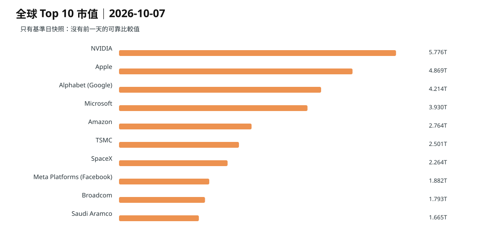
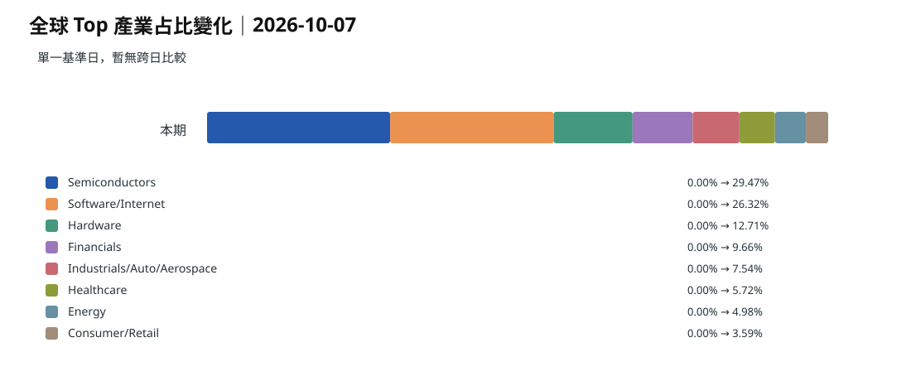
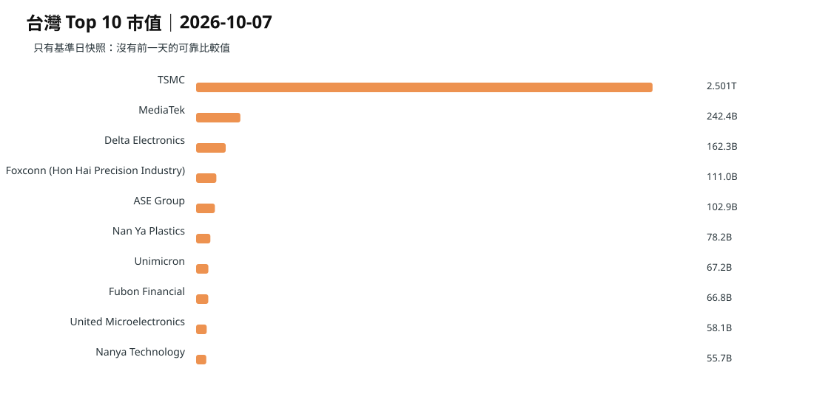
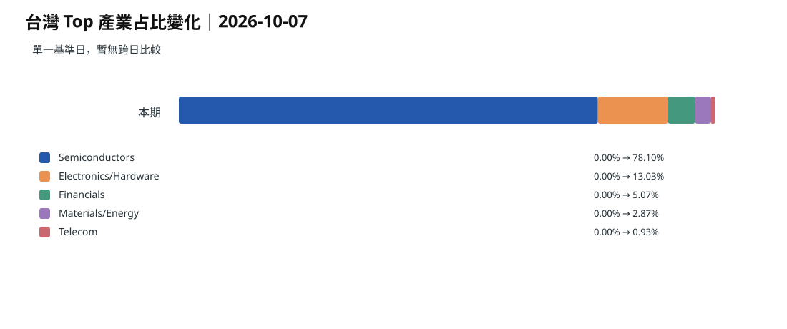
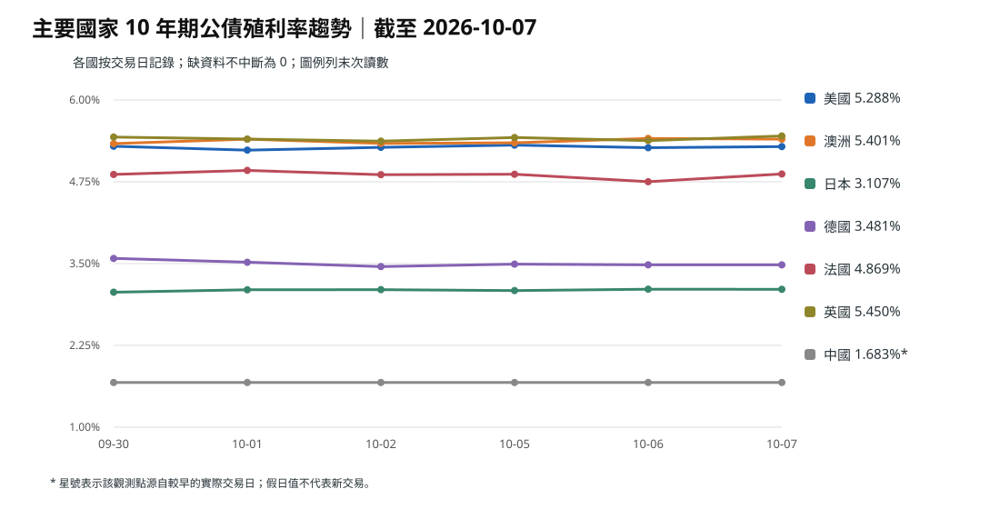
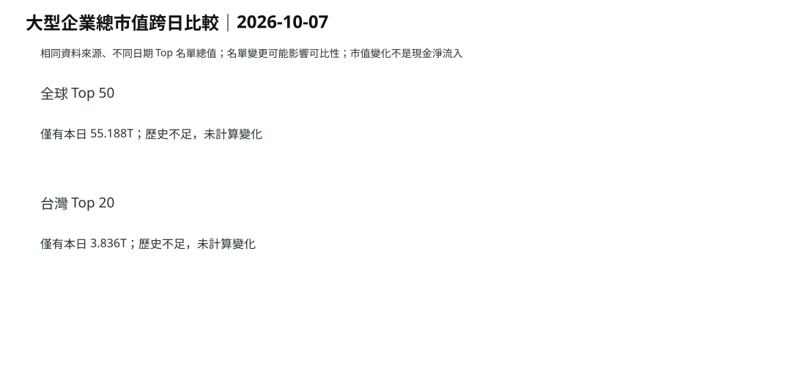

> 這篇已在 10/08 依固定資料層重新計算。市值使用 10/07 已發布的同口徑 CompaniesMarketCap 快照；主權債使用歷史收盤資料回填。
> 10/07 是市值歷史序列的第一個完整基準日，因此不偽造 1 日／3 日／7 日市值變化。

## 先看結論

- 全球前 50 大企業合計市值約 **55.188 兆美元**。
- 科技相關（半導體＋軟體／網路＋硬體）約占 **68.5%**。
- 台灣前 20 大企業合計約 **3.836 兆美元**，半導體約占 **78.1%**。
- 債券不是全球同步同方向：10/07 當天法國 **+11.8 bp**、英國 **+7.1 bp**，但澳洲 **-1.2 bp**；澳洲的問題是殖利率水準很高，不是當天仍在暴衝。

## 全球企業估值

資料：CompaniesMarketCap，固定快照基準日 2026-10-07。

**觀察：** 全球大型企業估值仍由 AI、半導體與大型平台主導。

**依據：** [固定快照｜2026-10-07](https://github.com/tibame201020/signal-notes/blob/main/data/market/snapshots/2026-10-07.json)、[CompaniesMarketCap](https://companiesmarketcap.com/)

**為什麼這樣判斷：** 半導體、軟體／網路與硬體合計約 68.5%；這不是新聞熱度，而是大型企業市值結構本身已高度向科技集中。

## 台灣估值集中度

**觀察：** 台灣的集中度比全球更高，主要風險仍是半導體週期與台積電權重，而不是單一日外資買賣超。

**依據：** [固定快照｜2026-10-07](https://github.com/tibame201020/signal-notes/blob/main/data/market/snapshots/2026-10-07.json)、[CompaniesMarketCap 台灣](https://companiesmarketcap.com/taiwan/largest-companies-in-taiwan-by-market-cap/)

**為什麼這樣判斷：** 台灣前 20 大企業約 78.1% 市值屬於半導體；這是結構性集中，遠比單日成交或外資流向穩定。

## 全球主權債｜高利率，但不是所有國家同步往上

| 國家 | 10年債 | 1日 | 3日 | 7日 |
| --- | ---: | ---: | ---: | ---: |
| 美國 | 5.288% | +1.7 | +1.1 | -0.5 |
| 澳洲 | 5.401% | -1.2 | +6.5 | +6.8 |
| 日本 | 3.107% | -0.2 | +0.5 | +4.4 |
| 德國 | 3.481% | 0.0 | +2.6 | -9.8 |
| 法國 | 4.869% | +11.8 | +1.0 | +0.7 |
| 英國 | 5.450% | +7.1 | +7.9 | +1.7 |
| 中國* | 1.683% | 0.0 | 0.0 | 0.0 |

* 中國因國慶假期，10/07 使用最近可交易日 9/30 的收盤值，因此短期變化不能和其他市場直接等量解讀。

**觀察：** 10/07 最急的壓力不是澳洲，而是法國與英國；澳洲則是「殖利率長時間維持極高」。

**依據：** [美國](https://www.investing.com/rates-bonds/u.s.-10-year-bond-yield-historical-data)、[澳洲](https://www.investing.com/rates-bonds/australia-10-year-bond-yield-historical-data)、[日本](https://www.investing.com/rates-bonds/japan-10-year-bond-yield-historical-data)、[德國](https://www.investing.com/rates-bonds/germany-10-year-bond-yield-historical-data)、[法國](https://www.investing.com/rates-bonds/france-10-year-bond-yield-historical-data)、[英國](https://www.investing.com/rates-bonds/uk-10-year-bond-yield-historical-data)

**為什麼這樣判斷：** 澳洲 10 年債為 5.401%，水準很高，而且 7 日仍高出 6.8 bp；但當天反而下降 1.2 bp。法國與英國當天分別跳升 11.8、7.1 bp，顯示當日風險重新定價更集中在歐洲財政與長債。

## 錢往哪裡走

截至 9/30 的一週，全球股票基金淨流入約 **347.6 億美元**，前一週約 **443.1 億美元**，流入速度約下降 **21.6%**。

**推論：** 資金還沒有全面離開股票，但願意追高的新增資金正在變慢。

**依據：** [Reuters｜全球股票基金流](https://www.reuters.com/world/china/global-markets-flows-graphic-2026-10-02/)

**為什麼這樣判斷：** 淨流入仍為正，但增量下降；同時大型科技市值集中度仍高。這比較像「資金仍在科技，但追價速度下降」，不是全面風險撤退。

<!-- trend-totals -->

## 全球與台灣總市值變化圖

> 市值差額是估值變化，不等於真實資金淨流入。

## 資料

- [全球前50大 CSV](./global-top50-2026-10-07.csv)
- [台灣前20大 CSV](./taiwan-top20-2026-10-07.csv)
- [固定市場快照](https://github.com/tibame201020/signal-notes/blob/main/data/market/snapshots/2026-10-07.json)
