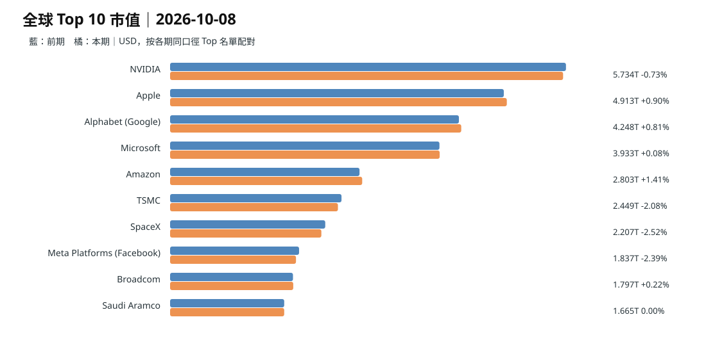
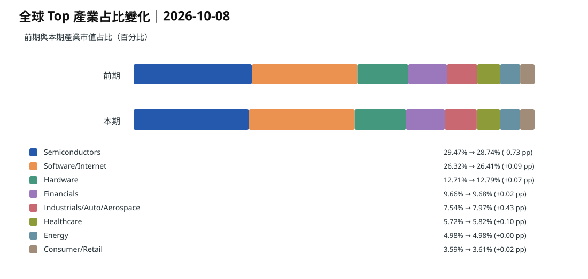
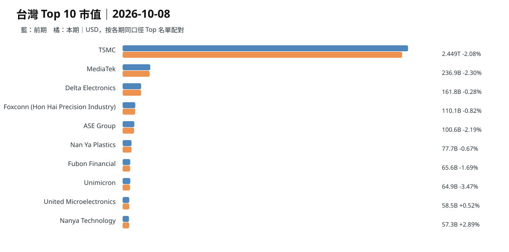
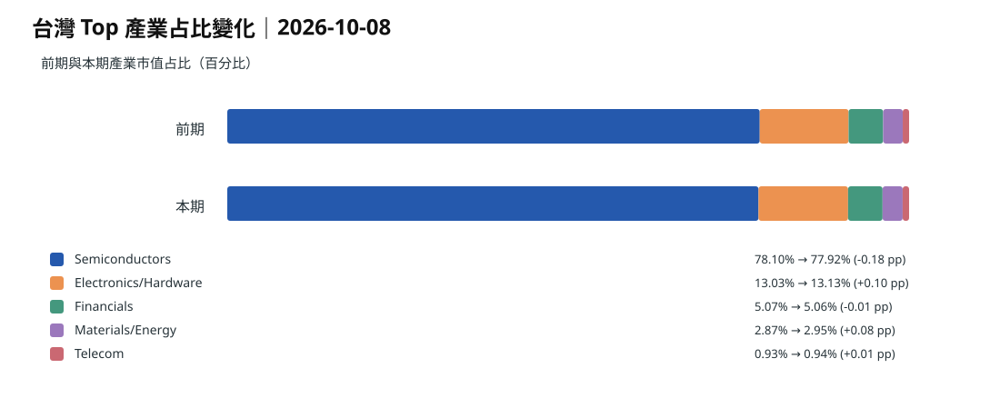
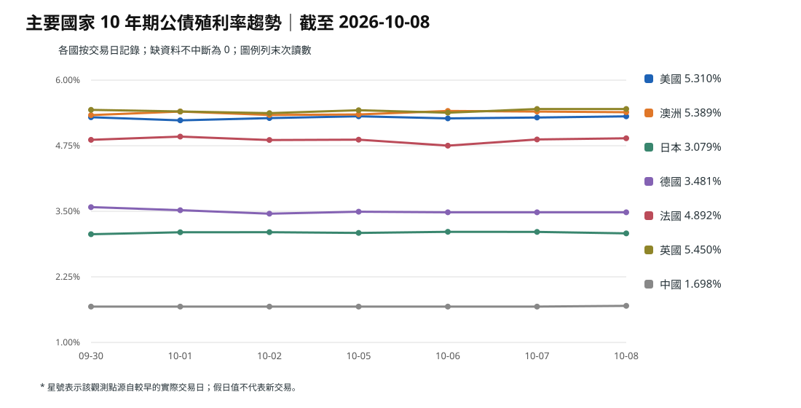
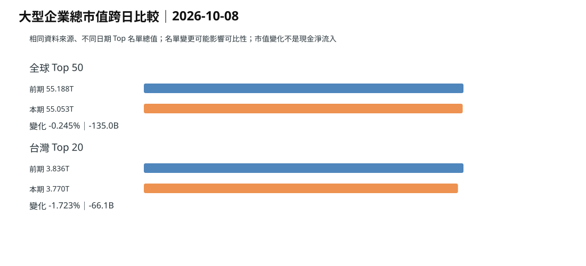

> 市場固定快照：**2026-10-08 09:43（台北時間）**。
> 這次已直接讀取 data/market/latest.json，不再沿用昨日圖表冒充今日資料。
> 3 日與 7 日市值歷史尚未完整累積，因此只對市值提供可驗證的 1 日比較。

## 一句話

**全球前 50 大企業市值只小幅下降，但台灣前 20 大下降更明顯；同時全球長債仍在高檔，資金成本已成為估值的重要上限。**

## 全球前 50 大企業

合計市值約 **55.116 兆美元**，較 10/07 的 **55.188 兆美元**下降約 **71.4 億美元**（**-0.129%**）。

> Top 50 名單有 1 家成分變動，49 家可逐家公司直接配對；因此總市值變化包含少量成分更替影響，不等同固定成分指數報酬。

資料：CompaniesMarketCap 固定快照，2026-10-08 09:43（台北時間）。

科技相關市值占比約 **68.0%**，昨日約 **68.5%**。

**觀察：** 科技仍高度集中，但一天內半導體占比由約 29.5% 降到 28.8%，並不是所有 AI 相關資產都一起上漲。

**依據：** [固定快照｜2026-10-08](https://github.com/tibame201020/signal-notes/blob/main/data/market/snapshots/2026-10-08.json)、[10/07 基準](https://github.com/tibame201020/signal-notes/blob/main/data/market/snapshots/2026-10-07.json)

**為什麼這樣判斷：** NVIDIA、TSMC、Meta、SpaceX 等大型權重一天內回落，但 Apple、Alphabet、Amazon、Micron 等仍上漲，顯示資金不是全面退出科技，而是在大型科技內部重新分配。

## 台灣前 20 大企業

合計市值約 **3.772 兆美元**，較 10/07 下降約 **63.8 億美元**（**-1.664%**）。

半導體占比仍約 **78.0%**；台積電市值由約 2.501 兆美元降到 2.449 兆美元，約 **-2.08%**。

**觀察：** 台灣這一天的市值下降幅度明顯大於全球前 50，但產業集中度幾乎沒變。

**依據：** [固定快照｜2026-10-08](https://github.com/tibame201020/signal-notes/blob/main/data/market/snapshots/2026-10-08.json)、[CompaniesMarketCap 台灣](https://companiesmarketcap.com/taiwan/largest-companies-in-taiwan-by-market-cap/)

**為什麼這樣判斷：** 前 20 大總市值下降約 1.66%，但半導體占比仍維持約 78%；這表示主要是高權重股票價格下降，而不是資金已完成跨產業大輪動。

## 全球主權債｜水準很高，但短線方向已分化

| 國家 | 10年債 | 1日 | 3日 | 7日 |
| --- | ---: | ---: | ---: | ---: |
| 美國 | 5.301% | +1.3 | -1.0 | +6.7 |
| 澳洲 | 5.388% | -1.3 | +4.2 | -1.3 |
| 日本 | 3.084% | -2.3 | -0.4 | -1.6 |
| 德國 | 3.481% | 0.0 | -1.2 | -4.0 |
| 法國 | 4.892% | +2.3 | +2.7 | -3.2 |
| 英國 | 5.447% | -0.4 | +2.0 | +4.4 |
| 中國* | 1.698% | +1.5 | +1.5 | +1.5 |

* 中國 10/07 的比較基準仍是國慶假期前最近可交易日，因此短期變化包含假期空窗。

### 澳洲

澳洲 10 年債約 **5.388%**，在這組市場中只低於英國，甚至高於美國。

但它不是這幾天一路上衝：1 日 **-1.3 bp**、3 日 **+4.2 bp**、7 日 **-1.3 bp**。

**觀察：** 澳洲現在真正特殊的是「高殖利率平台」，不是單日失控。

**依據：** [固定快照](https://github.com/tibame201020/signal-notes/blob/main/data/market/snapshots/2026-10-08.json)、[澳洲 10 年債](https://tradingeconomics.com/australia/government-bond-yield)

**為什麼這樣判斷：** 如果殖利率水準長時間維持在 5.3%–5.4% 附近，即使每日沒有繼續上升，房貸重定價與家庭現金流壓力仍會持續累積。澳洲因此適合當全球高利率環境的壓力測試市場。

### 全球債率是不是一直往上？

目前數據顯示：**不是同步往上，而是高檔分化。**

- 美國：7 日 **+6.7 bp**
- 英國：7 日 **+4.4 bp**
- 澳洲：7 日 **-1.3 bp**
- 日本：7 日 **-1.6 bp**
- 德國：7 日 **-4.0 bp**
- 法國：7 日 **-3.2 bp**，但近 3 日又 **+2.7 bp**

**推論：** 全球共同背景仍是高資金成本，但各國開始被不同因素主導：美英偏通膨與長期資金供給，法國偏財政風險，德國有相對避險需求，日本則受央行正常化與本國資金回流影響。

**依據：** [Reuters｜10/08 全球債市與 AI 發債](https://www.reuters.com/world/china/global-markets-global-markets-2026-10-08/)、[Reuters｜10/07 全球市場](https://www.reuters.com/world/china/global-markets-global-markets-2026-10-07/)、固定市場快照。

**為什麼這樣判斷：** 若是單一全球通膨衝擊，主要國家殖利率應更一致上升；現在德國、日本、澳洲的 7 日變化並未同步向上，表示「高利率」是共同環境，「為什麼高」則已經區域化。

## 錢往哪裡走

全球股票基金截至 9/30 的一週仍淨流入約 **347.6 億美元**，但比前一週下降約 **21.6%**。

**推論：** 股票仍有資金承接，但投資人對高估值的容忍度降低；債券能提供 5% 左右收益後，股票必須用更高的獲利成長才能競爭。

**依據：** [Reuters｜全球股票基金流](https://www.reuters.com/world/china/global-markets-flows-graphic-2026-10-02/)、[固定債率快照](https://github.com/tibame201020/signal-notes/blob/main/data/market/snapshots/2026-10-08.json)

**為什麼這樣判斷：** 新增股票資金仍為正，但流入速度變慢；同時美國、澳洲、英國長債都在 5% 以上。這會提高股票的比較門檻。

<!-- trend-totals -->

## 全球與台灣總市值變化圖

> 市值差額是估值變化，不等於真實資金淨流入。

## 資料下載

- [全球前 50 大企業 CSV](./global-top50-2026-10-08.csv)
- [台灣前 20 大企業 CSV](./taiwan-top20-2026-10-08.csv)
- [固定市場快照](https://github.com/tibame201020/signal-notes/blob/main/data/market/snapshots/2026-10-08.json)
