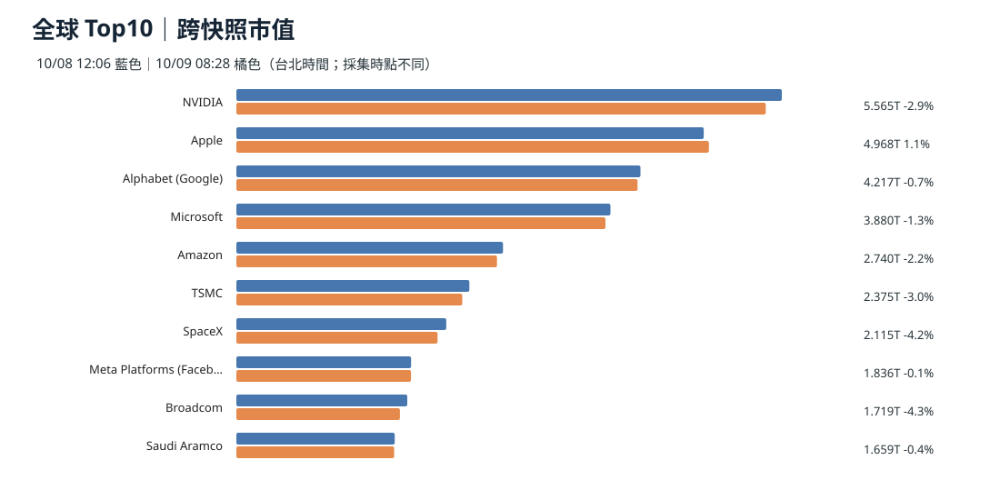
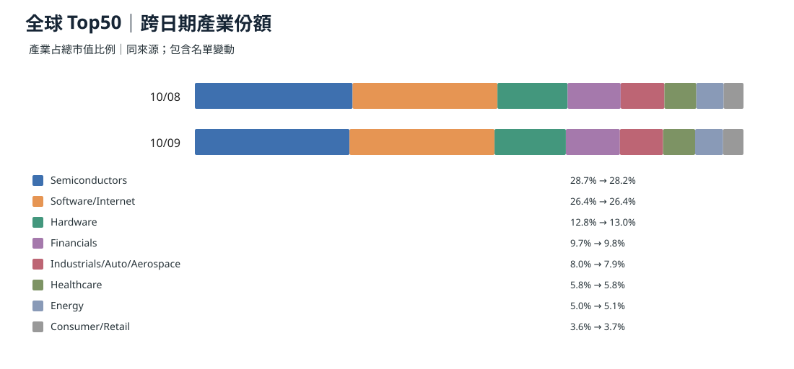
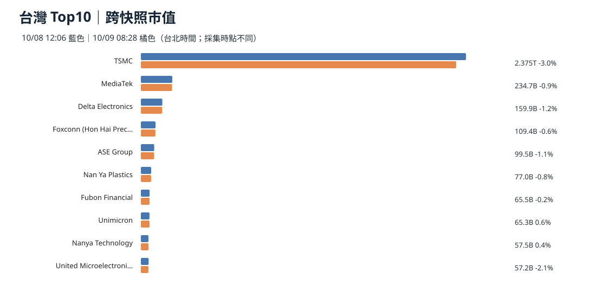
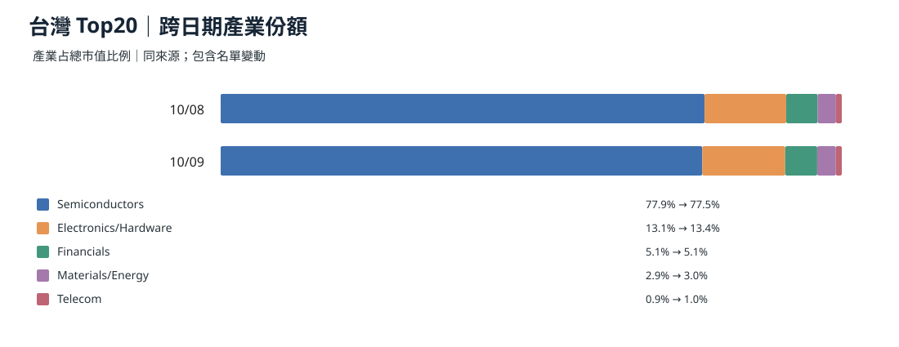
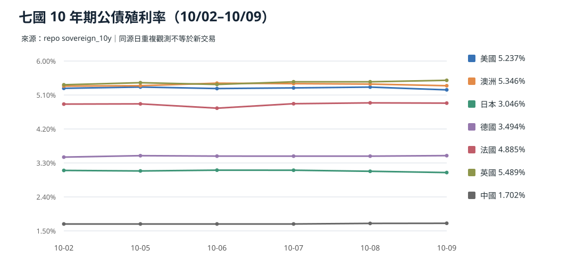
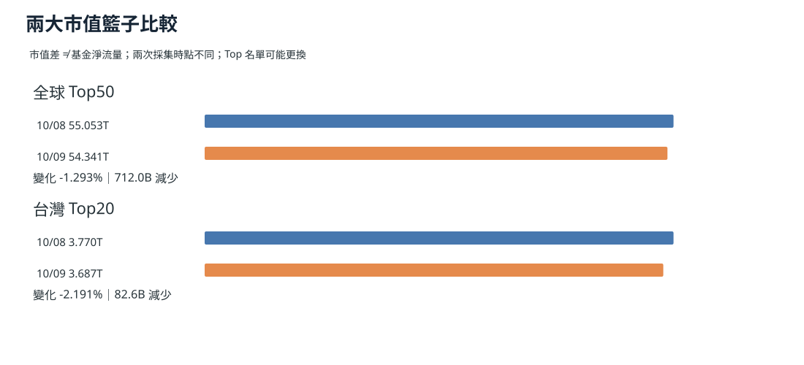

> 截稿基準：2026-10-09 台北上午。比較區間：昨日 10/08、近三日 10/06–08、近七日 10/02–08。訊息按原始公告日而非搜尋日期歸類。推論不同於已實現營收或現金流。

## 資料範圍與時間戳

**本期市場快照 10/09 08:28 台北時間（UTC 00:28）**，全球 Top50、台灣 Top20 來自 CompaniesMarketCap 頁面資料；比較基準為 **10/08 12:06 台北時間**。兩次採集時點不一致，尤其台灣基準日並非收盤；**這是兩個來源快照的差，不是完整交易日價格報酬**。殖利率按各國 source_date 辨識交易日期，10/01–07 中國假期數值不得重複當成新交易。

**依據：** [10/09 市場快照](https://github.com/tibame201020/signal-notes/blob/main/data/market/snapshots/2026-10-09.json)、[10/08 基準](https://github.com/tibame201020/signal-notes/blob/main/data/market/snapshots/2026-10-08.json)、[CompaniesMarketCap](https://companiesmarketcap.com/)。

## 全球前十大市值跨日比較

**全球前五十合計：約 54.341 兆美元**，上期約 55.053 兆，差約 **-0.712 兆（-1.29%）**，**包含 Top50 可能換股**，不等於固定成分股報酬，也不等於現金外流。

**依據：** 同口徑快照與 [全球 Top50 CSV](./global-top50-2026-10-09.csv)。

**為什麼這樣判斷：** 市值是價格 × 股數加總；個股重估、公司入榜／出榜、幣別換算都能造成變動。產業份額比較只能顯示權重，不能證明基金買賣方向。

## 台灣前十大市值跨日比較

**台灣前二十合計：約 3.687 兆美元**，前期約 3.770 兆，差約 **-0.083 兆（-2.19%）**；兩期採集時點不一，不使用「台股整日跌幅」措辭。

**依據：** [台灣 Top20 CSV](./taiwan-top20-2026-10-09.csv)、[CompaniesMarketCap 台灣排行](https://companiesmarketcap.com/taiwan/largest-companies-in-taiwan-by-market-cap/)。

**為什麼這樣判斷：** 高集中產業的市值變化主要由少數大型公司主導，需要追同成分、收盤價、股數口徑後才能確認真正輪動。

## 多國 10 年債：可觀察的七日曲線

| 市場 | 10/09 快照 | 相較 10/08 (bp) | 相較 10/02 (bp) |
| --- | ---: | ---: | ---: |
| 美國 | 5.237% | -7.3 | -4.0 |
| 澳洲 | 5.346% | -4.3 | +1.0 |
| 日本 | 3.046% | -3.3 | -5.6 |
| 德國 | 3.494% | +1.3 | +3.9 |
| 法國 | 4.885% | -0.7 | +2.6 |
| 英國 | 5.489% | +3.9 | +11.8 |
| 中國大陸 | 1.702% | +0.4 | +1.9* |

*中國 10/02 快照繼承 09/30 觀測；假期空窗不能作每日漲跌的證據。表格數值依 repo 原始資料四捨五入。

### 澳洲｜高債率如何進入實體消費

澳洲 10 年債 5.346% 雖較昨日下降 4.3bp，仍是資金成本高平台。政策利率據 10/08 報導達 4.6%。住宅可變利率、再融資與支出壓力是**逐步傳導**，不是同日市場報價的機械等號。

**依據：** [Reuters｜澳洲 AI 投資與通膨](https://www.reuters.com/world/asia-pacific/ai-boom-fuel-australia-inflation-despite-higher-rates-ex-rba-official-says-2026-10-08/)。

**為什麼這樣判斷：** AI 基建對非貿易財資源形成競爭，央行升息壓抑一般家庭；房貸與零售銷售後續實測才可驗證需求擠出。

## 全球／台灣市值總量

## 真實金流 vs 市值變化

本次快照**沒有交易所法人淨買超、ETF 淨申贖、基金淨流入**欄位，因此不能從 -1.29% 或 -2.19% 市值差推論「多少資金撤出」。若要量化真正流向，需另接可核驗的 TWSE 三大法人、基金流量及跨境交易序列。無同口徑新數據，這一欄明記**未取得**。

## 七日比較與反證

最近有市值資料的連續日僅 10/07、10/08、10/09；**全球／台灣 7 日市值總量不可計算**。債率則使用可得的 10/01–09 序列，保留來源日與假日重複值。若後續補齊定時收盤資料、去除成分變動，市值回落幅度可能改變，本文暫不將它定義為資金撤離。
