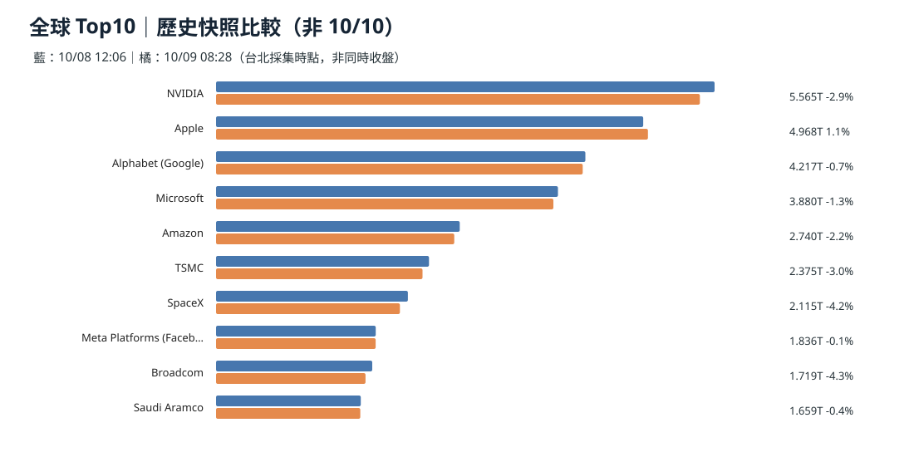
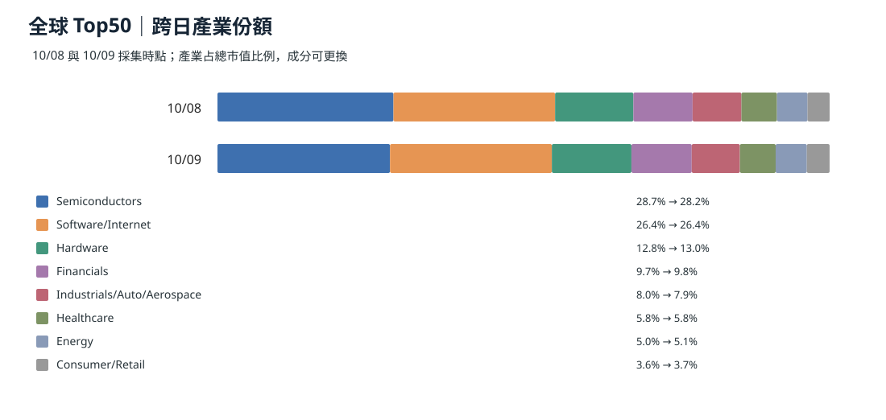
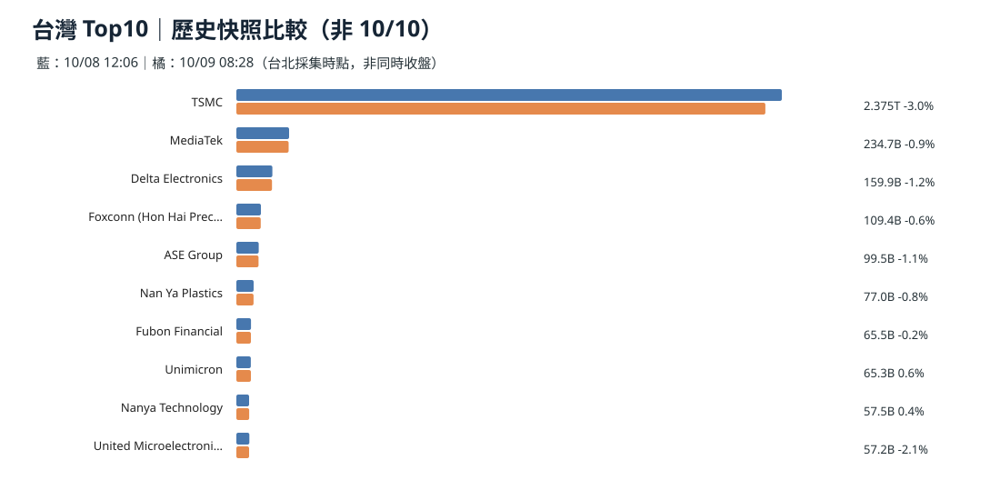
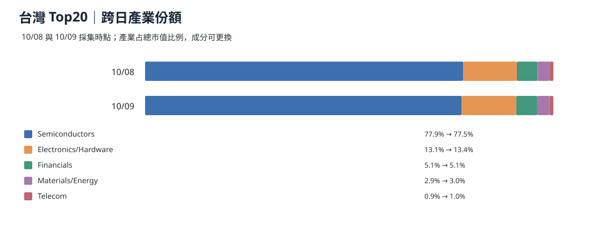
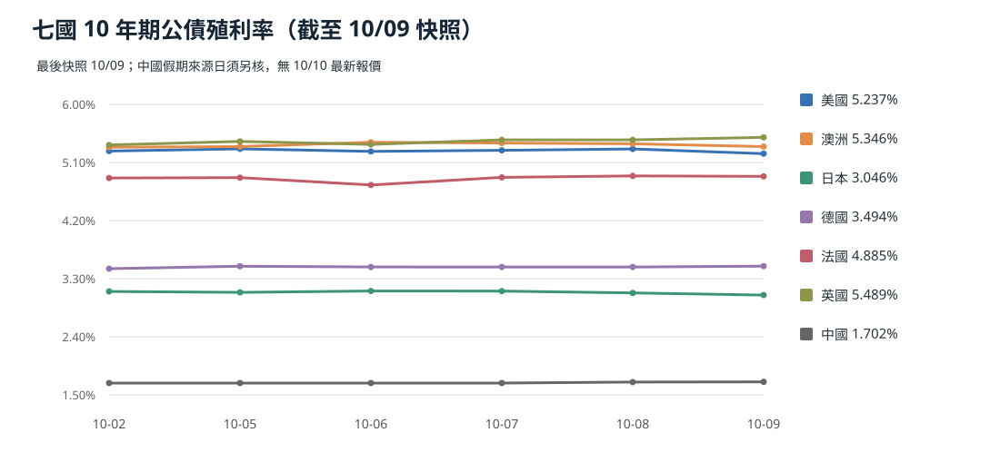
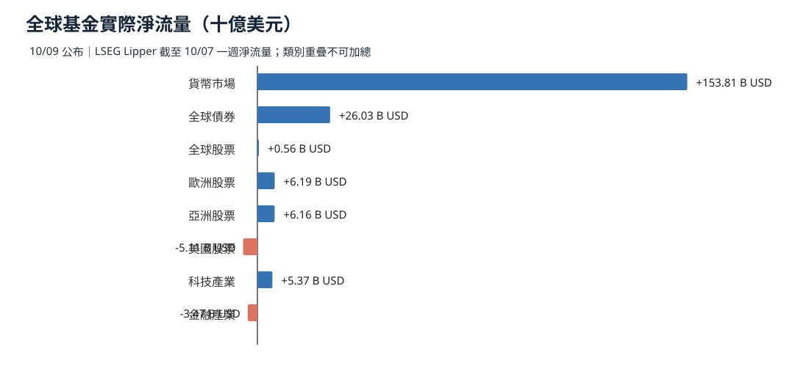
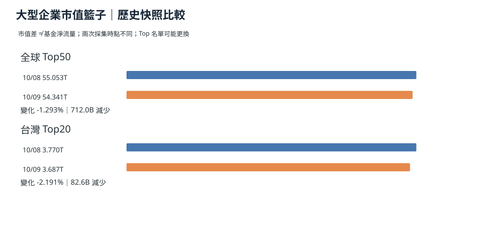

> 截稿：台北 2026-10-10 05:00。**最新完整國際事件日為 10/09**；台灣、韓國 10/09 休市，最近台股收盤為 10/08。比較窗口：昨日 10/09、近三日 10/07–09、近七日 10/03–09。非交易日不虛構新報價。

## 資料時效：10/10 快照未到，不把舊資料冒充今日

截稿 **10/10 05:00 台北**，repo `data/market/latest.json` 仍是 **10/09 08:28 台北採集**，沒有 `data/market/snapshots/2026-10-10.json`。以下全球 Top50、台灣 Top20 只能比較 **10/07、10/08、10/09 的歷史快照**；最後一筆**並未包含美股 10/09 完整收盤**。台灣 10/09 國慶假期休市。圖表上「10/09」是**資料採集日**，不是所有交易所的新收盤價。

**依據：** [最新可用快照](https://github.com/tibame201020/signal-notes/blob/main/data/market/snapshots/2026-10-09.json)、[10/08 快照](https://github.com/tibame201020/signal-notes/blob/main/data/market/snapshots/2026-10-08.json)、[10/07 快照](https://github.com/tibame201020/signal-notes/blob/main/data/market/snapshots/2026-10-07.json)。

## 全球 Top10 市值：跨日比較

全球 Top50 在 10/09 快照約 **54.341 兆美元**，10/08 約 **55.053 兆美元**，兩個採集時點差 **-1.29%**；**Top50 成分可變動，這不是固定成分股日報酬，也不是基金贖回金額**。

**依據：** [全球 Top50 資料表](./global-top50-2026-10-09.csv)、[CompaniesMarketCap](https://companiesmarketcap.com/)。

**為什麼這樣判斷：** 市值 = 價格 × 股數；成分股替換、匯率、報價時間都會改變總額，不能推論真實資金淨流。

## 台灣 Top10 與 Top20：假期前資料

台灣 Top20 10/09 快照約 **3.687 兆美元**、10/08 約 **3.770 兆美元**，兩個採集時點差 **-2.19%**。**10/09 沒有台股交易，不能寫成當日台股跌幅**。

**依據：** [台灣 Top20 CSV](./taiwan-top20-2026-10-09.csv)、[台灣排行來源](https://companiesmarketcap.com/taiwan/largest-companies-in-taiwan-by-market-cap/)。

**為什麼這樣判斷：** 假日報價可能是前次交易日與跨市場 ADR 換算，並非台股新增成交資料。

## 七國十年期公債：10/02–09 跨日趨勢

| 市場 | 10/09 快照 | 10/08 快照 | 10/02 快照 |
| --- | ---: | ---: | ---: |
| 美國 | 5.237% | 5.310% | 5.277% |
| 澳洲 | 5.346% | 5.389% | 5.336% |
| 日本 | 3.046% | 3.079% | 3.102% |
| 德國 | 3.494% | 3.481% | 3.455% |
| 法國 | 4.885% | 4.892% | 4.859% |
| 英國 | 5.489% | 5.450% | 5.371% |
| 中國大陸 | 1.702% | 1.698% | 1.683%* |

*中國 10/02 來源日是 09/30，10/01–07 長假數值不能作連續新交易點。**所有 10/10 最新債率仍缺資料**，不可沿用為今日收盤。

**依據：** [10/02 快照](https://github.com/tibame201020/signal-notes/blob/main/data/market/snapshots/2026-10-02.json)、[10/09 快照](https://github.com/tibame201020/signal-notes/blob/main/data/market/snapshots/2026-10-09.json)。

### 澳洲：債率高位、房貸與消費的慢傳導

澳洲 10/09 觀測的 10 年債 **5.346%**，比 10/08 降 4.3 個基點，卻仍高於 10/02 約 1 個基點。澳洲央行政策利率約 4.6%（10/08 Reuters），資料中心擴張可能加大本地施工／電力需求。房貸壓力要經銀行定價、浮動利率重設及家庭支出才會呈現，**不以當日殖利率直接換算家庭支出**。

**依據：** [Reuters｜澳洲 AI 投資與通膨](https://www.reuters.com/world/asia-pacific/ai-boom-fuel-australia-inflation-despite-higher-rates-ex-rba-official-says-2026-10-08/)。

**為什麼這樣判斷：** 資本密集型基建與家庭房貸會競爭相同金融資源，傳導方向可推論，但缺最新房貸重定價和零售數據時無法量化效果。

## 真正金流：10/09 公布的截至 10/07 週度淨申贖

| 週度資產類別／區域 | 淨流量（十億美元） |
| --- | ---: |
| 全球貨幣市場基金 | **+153.81** |
| 全球債券基金 | **+26.03** |
| 全球股票基金 | **+0.56** |
| 歐洲股票基金 | +6.19 |
| 亞洲股票基金 | +6.16 |
| 美國股票基金 | -5.11 |
| 全球科技產業基金 | +5.37 |
| 全球金融產業基金 | -3.47 |

**依據：** [Reuters｜10/09 LSEG Lipper 週度基金淨申贖](https://www.reuters.com/world/china/global-markets-flows-graphic-2026-10-09/)；資料觀察期間**截至 10/07**，不是 10/09 當天。

**為什麼這樣判斷：** 貨幣基金淨流入與美國股票基金淨流出提供真正的資金方向證據；但各欄存在母子集合（全球股票包含區域與產業），**不能把各欄加總**。也不能把它與 Top50 市值變動相加。

## 全球與台灣大型公司總市值的跨日比較

## 昨日／三日／七日

昨日 10/09 新增的是**可核實的基金淨流量報告**；近三日可比較 10/07–09 市值快照，但時點不同；近七日有多國殖利率序列，**全球 Top50／台灣 Top20 缺 10/03–06 同口徑完整市值序列**，因此不製造七日市值趨勢。後續應補固定收盤時點與真正 TWSE 法人流量。
